# 🔥 SIGNUP
 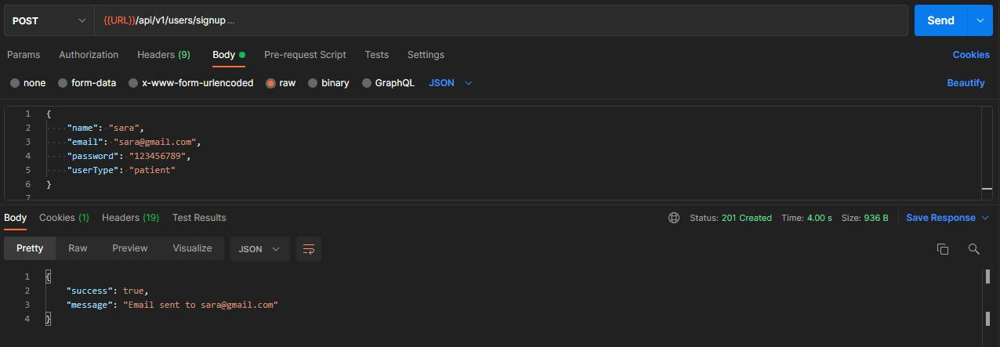
 
# 🔥 EMAIL
 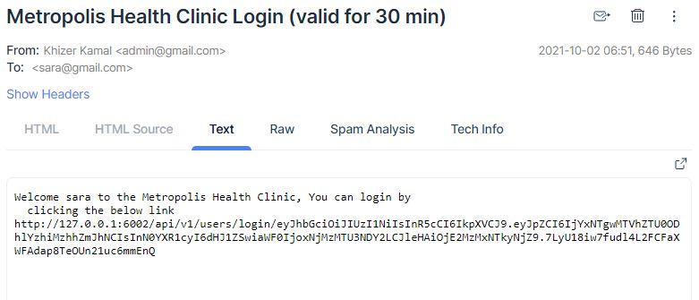

 # 🔥 EMAIL LINK TO TURN STATUS TRUE
 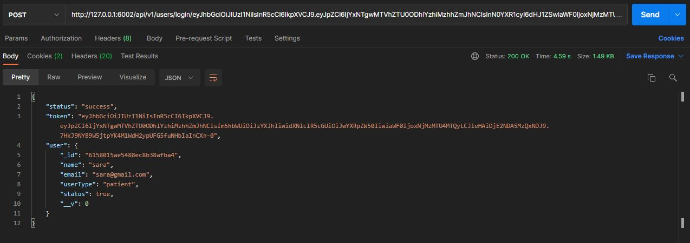

 # 🔥 USER"S DASHBOARD BEFORE BOOKING ANY APPOINTMENT
 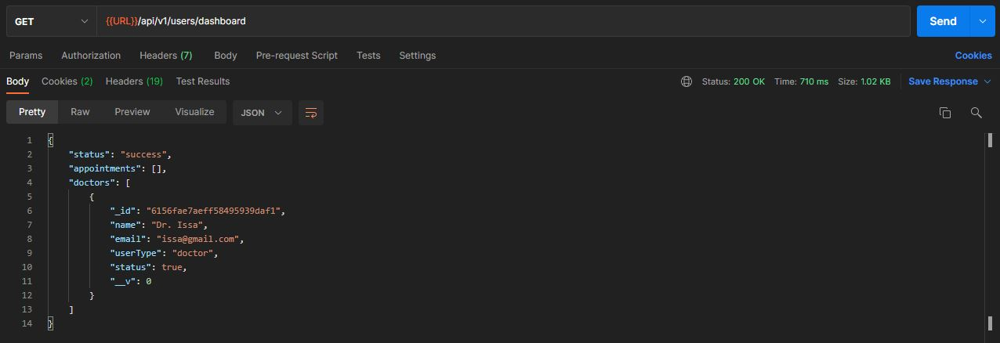

 # 🔥 BOOK APPOINTMENT
 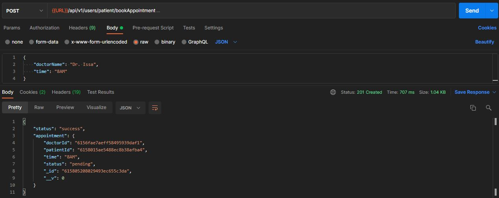

 # 🔥 USER"S DASHBOARD AFTER BOOKING AN APPOINTMENT
 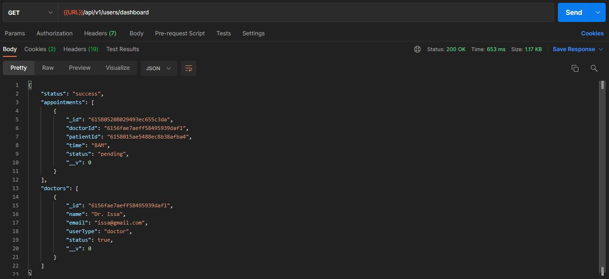

  # 🔥 PROTECTED ROUTES
 

  # 🔥 LOGIN DOCTOR
 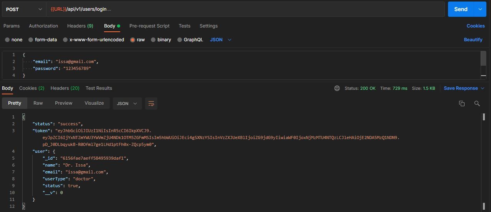

  # 🔥 DOCTOR'S DASHBOARD
 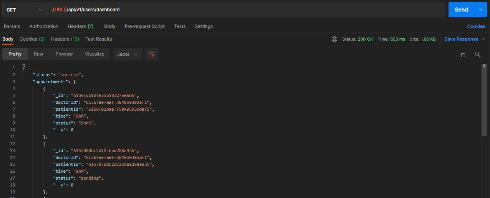
 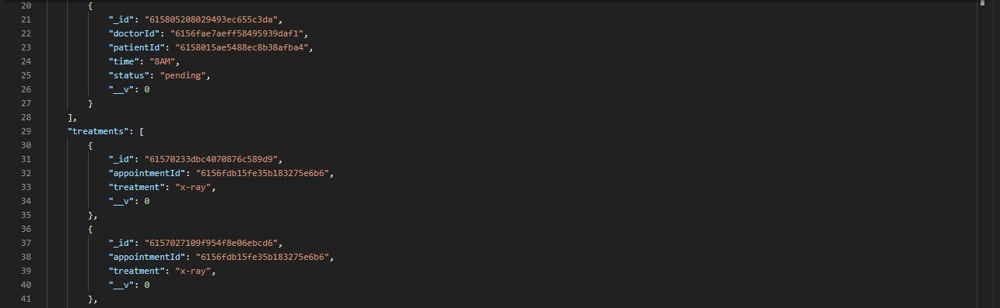
 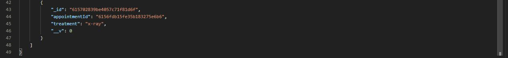

  # 🔥 DOCTOR'S TREATMENT
 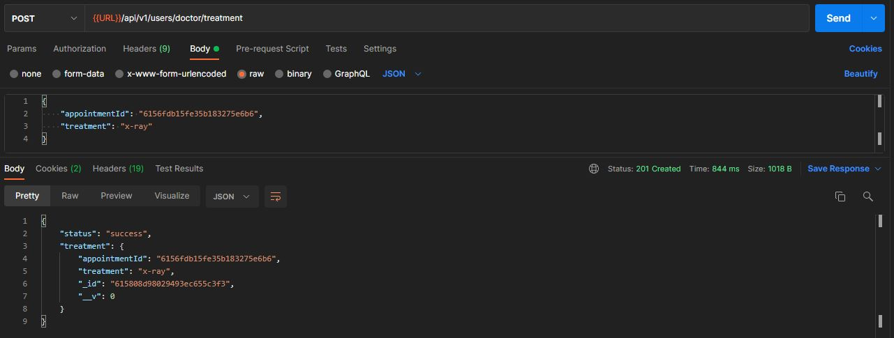

   # 🔥 DATABASE COLLECTIONS
 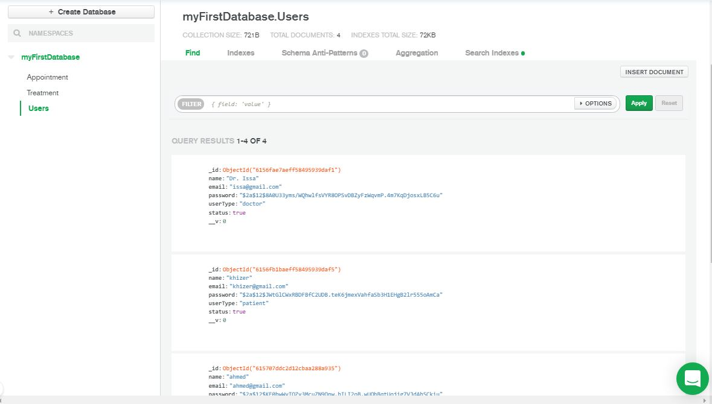
